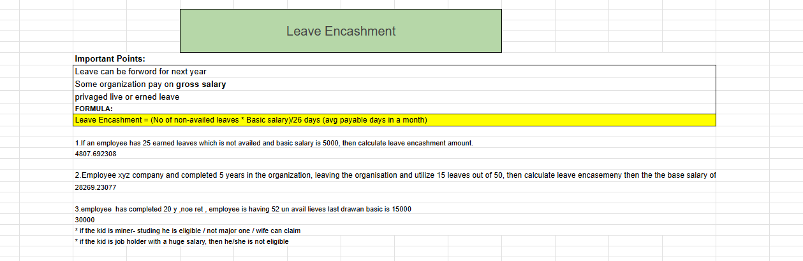

ji# Payroll_calculations-types
Types and its discription 

### Types of PayRoll information
--------------------------------------------

| No.| Questions                                                                                                                                                                   |
| ---| ----------------------------------------------------------------------------------------------------------------------------------------------------------------------------------------------------------------------------------------------------------------------|
|    | **table-of-concepts**                                                                                                                                                          |                                                                                                                                                                    
| 1  | [KRA-KPI'S](#)                                                                                                                                                           |
| 2  | [Payable-days](#)                                                                                                                                                        |
| 3  | [Payment-of-gratuity](#)                                                                                                                                                         |
| 4  | [PF_Policies](#)                                                                                                                                                
| 5   |[Payroll-management](#)                                                                                                                                                 |
| 6 |[payroll calculations](#)                                                                                                                                                 |  
| 7 |[CTC-Is-given](#)                                                                                                                                                         |                                                                      
| 8 |[Payroll_management](#)                                                                                                                                                  | 
| 9 |[Payroll_management_calculations](#)                                                                                                                                     |                                                   
| 10 |[Payroll_calculations](#)                                                                                                                                               |                                                        
| 11 |[Blue_colour_employees](#)                                                                                                                                              |  
| 12 |[Extra_working_houre](#)                                                                                                                                                 |
| 13 |[Payment_of_Bonus_Act](#)                                                                                                                                                |
| 14 |[Slab_systems](#)                                                                                                                                                        |
| 15 |[Slab_system_different_sections](#)                                                                                                                                     |    

  

| 1  | [KRA KPI'S](#) 

1.  ### What are KRA, KPI'S?
   KRA, KPI'S we called it has "KEY RELATED AREAS" & "KEY PERFORMANCE AREAS" with regards to 
   this, these were compared with 360degrees and points scale calculation we can get to know in 
   the below information,
   
   
 
## Recruitment process 

## Salary increment on performance calculation

   
**[⬆ Back to Top](#Payroll_calculations-types)**

   
   | 2  | [Payable-days](#)     

## calculation-of- payable-days

 Payable days allways calculated on which month 30/31 days and then the company is fallowing WEEKLY-OFF : 5 DAYS WORKING PERIOD or 6 DAYS WORKING PERIOD, along with Holiday calender shedule etc as in the below information 

   

<ul><li> sample months SEPTEMBER and FEBRUARY months payable calculation with SANDWITCH rule .</ll>

<li> When gross salary was given, leaving metro city with january payable calcutation and leave and absent, working days. </li></ul>

 

<ul><li> Same as february month calculation leaving in metro, Gross salary is 32,000 then calculate payable days on this month. </li></ul
                                                                                                                        
  

<ul><li> Same as february month calculation with metro, Gross salary is 32,000 then calculate payable days in this month. </li></ul
                                                         
 
 <ul><li> Same as february month calculation with metro, Gross salary is 42,000 then cakculate payable days in thais nonth. </li></ul>
                                                         
<ul><li>calculation and month tax and holiday shedule under paydays
</li></ul>

 

**[⬆ Back to Top](#Payroll_calculations-types)**

| 3  | [Payment-of-gratuity](#) 

## Payment_gratuity 
<ul><li> Pament of Graduity act & instruction to fallow and formulas, eligibility for gratuity </li></ul>

 ## Payment_gratuity 
 <ul><li> Basic questions and points to understand about gratuity </li></ul>
 

 
## Leave-Encashment

## EPS-Pension 

## Unpaid-Salary

**[⬆ Back to Top](#Payroll_calculations-types)**

| 4  | [PFpolicies](#) 
 <ul><li>PF_POLICIES and its act's , types</li></ul>
 

<ul><li> its calculations </ul></li>

**[⬆ Back to Top](#Payroll_calculations-types)**

 | 5   |[Payroll-management](#)
  <ul><li> PayRoll management and its types like TAKE HOME, FTH, CTC, GROSS, DEDUCTIONS, CONTRIBUTIONS,etc in payroll how to function with this process </li></ul>
 
 

 
 <ul><li> PM and Employees wages and difference between WHILE COLOR & BLUE COLOR Employees  </li></ul>
 
  

 <ul><li> Difference between GROSS, DEDUCTIONS, CONTRIBUTIONS and FORMULAS, how to calculate on the PAY-ROLL types </li></ul>
 
**[⬆ Back to Top](#Payroll_calculations-types)**

| 6 |[payroll calculations](#)  

<ul><li> Different types of metro and non-metro cities GROSS Salary was given and calculated on GROSS & CTC , Formulas on CTC, SA, GROSS </li></ul>
 
 

 

 

 
| 7 |[CTC-Is-given](#) 

<ul><li> Different types of Metro and Non-metro along with PT_EVERY STATE has professional TAX along with different PF policies implemented based on GROSS   </li></ul>

 <ul><li> When CTC is given then, how to calculated SP-Special allowance by using formula as 
given above.</li></ul>
 
 

<ul><li> When CTC is given with non-metro then calculate total contribution first then SP and GROSS methods . </li></ul>

| 8 |[Payroll_management](#)

| 9  |[Payroll_management_calculations](#)                                                                                                                                                      |                                                                                                                               
| 10 |[payroll_calculationd|(#)    |                                                                                                                              
